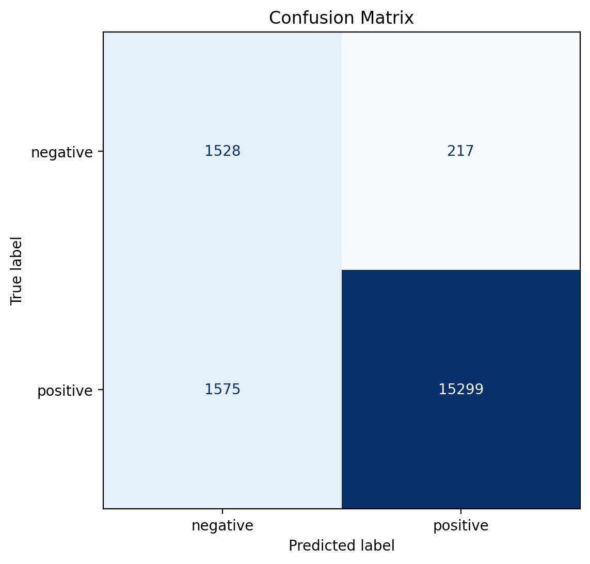
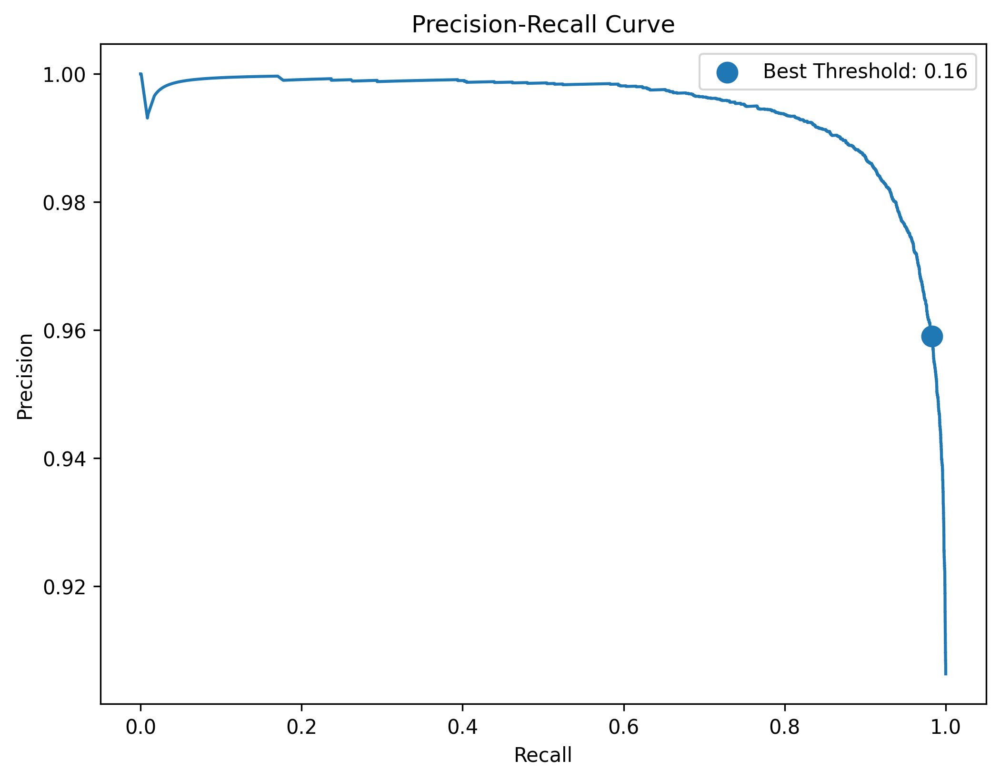
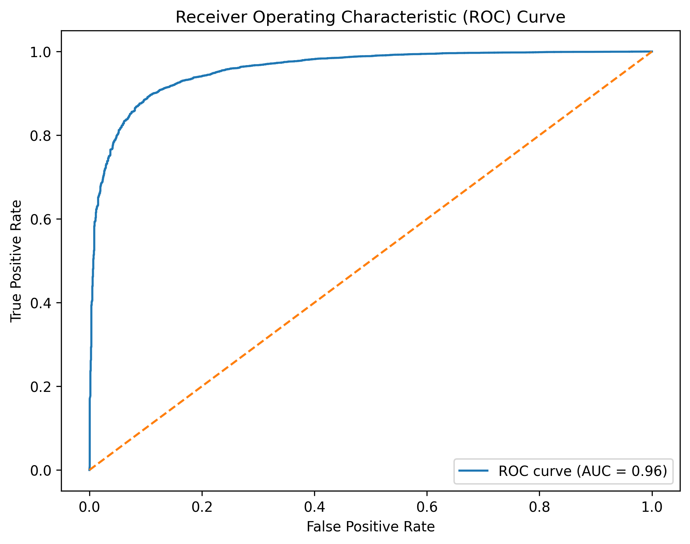
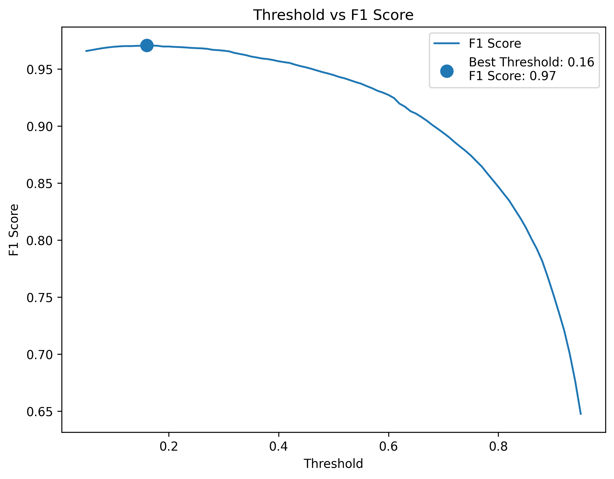
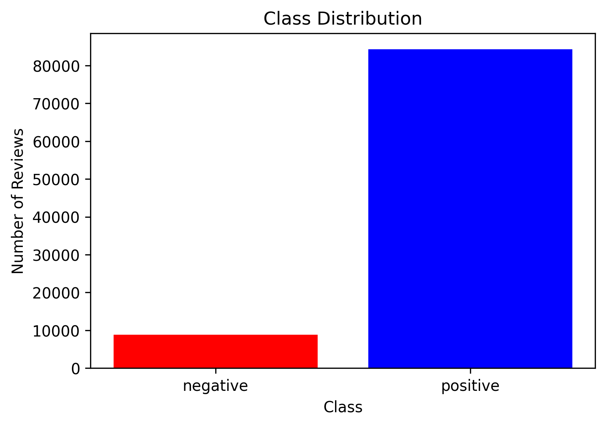
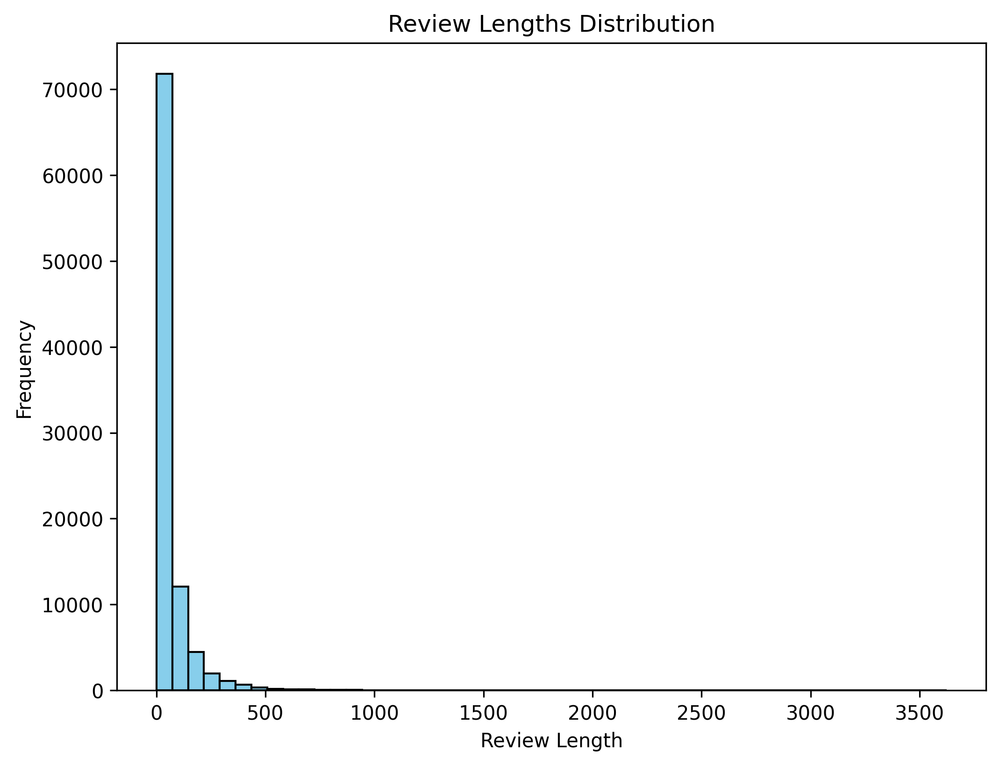

# Amazon Review Sentiment Analysis

## Executive Summary

**Problem**
Build a sentiment classification system for Amazon product reviews and analyze why strong aggregate metrics (e.g., accuracy, F1-score) can still hide critical real-world failure cases.

**Dataset**
Amazon Electronics reviews (~100,000 sampled subset from a large-scale dataset).

* Positive: rating ≥ 4
* Negative: rating ≤ 2

**Best Model**
TF-IDF + Logistic Regression with class weighting and threshold optimization

**Best Performance**

* F1-score ≈ **0.97** at optimal threshold (~0.16)
* Default threshold F1 ≈ **0.945**

**Why This Project Is Non-Trivial**
This is not a standard text classification task. The project addresses:

* Class imbalance
* Threshold selection beyond default (0.5)
* Misleading aggregate metrics
* Real-world model reliability through error analysis

**Key Insight**
High performance metrics do not guarantee reliability.
Careful threshold tuning and structured error analysis are essential to uncover model weaknesses.

---

## Results

### Confusion Matrix


### Precision-Recall Curve


### ROC Curve


### Threshold Optimization


### Class Distribution


### Review Length Distribution


### Threshold Optimization

* Systematically evaluated thresholds from 0.05 → 0.95
* Identified optimal threshold maximizing F1-score
* Demonstrates how default thresholds can be suboptimal

---

## Methodology

### 1. Data Processing

* Removed neutral reviews (rating = 3)
* Converted ratings into binary labels
* Cleaned text data (basic preprocessing)
* Generated a structured dataset for modeling

### 2. Feature Engineering

* TF-IDF vectorization
* Sparse high-dimensional representation of text

### 3. Models Evaluated

* Logistic Regression
* Naive Bayes (Multinomial)
* (Optional extensions ready)

### 4. Model Optimization

* Class weighting for imbalance handling
* Threshold tuning based on F1-score
* Precision-recall trade-off analysis

### 5. Evaluation Strategy

* Accuracy, Precision, Recall, F1-score
* Confusion Matrix
* Precision-Recall Curve
* Threshold vs F1 analysis

---

## Error Analysis

To move beyond surface-level metrics, the project includes manual error analysis:

* Misclassified samples inspection
* Identification of common failure patterns:

  * Mixed sentiment
  * Weak sentiment signals
  * Ambiguous language
  * Label noise

This step highlights the gap between **metric performance** and **real-world robustness**.

---

## Repository Structure

```
amazon-sentiment-analysis/
├── data/
│   ├── raw/
│   ├── interim/
│   └── processed/
├── notebooks/
├── src/
├── configs/
├── results/
│   ├── figures/
│   ├── tables/
│   └── error_analysis/
├── reports/
├── demo/
├── tests/
├── README.md
├── requirements.txt
└── LICENSE
```

---

## How to Reproduce

```bash
git clone https://github.com/trandamkhanh311207-glitch/amazon-sentiment-analysis.git
cd amazon-sentiment-analysis
pip install -r requirements.txt
jupyter notebook
```

Open:

```
notebooks/main.ipynb
```

---

## Dataset

The original dataset is too large to be included in this repository.

You can download it from:
https://nijianmo.github.io/amazon/index.html

This project uses a sampled subset (~100k reviews) located in:

```
data/interim/
```

---

## Key Takeaways

* Default classification thresholds are often suboptimal
* High F1-score can still mask systematic model failures
* Error analysis is essential for understanding model behavior
* Structured pipelines improve reproducibility and clarity

---

## Future Improvements

* ROC Curve and calibration analysis
* Transformer-based models (BERT, RoBERTa)
* Explainability (SHAP / feature importance)
* Deployment (Streamlit demo)

---

## Author

**Tran Dam Khanh**

This project was developed as part of a data science portfolio focused on building **real-world, interpretable, and production-aware machine learning systems**.
